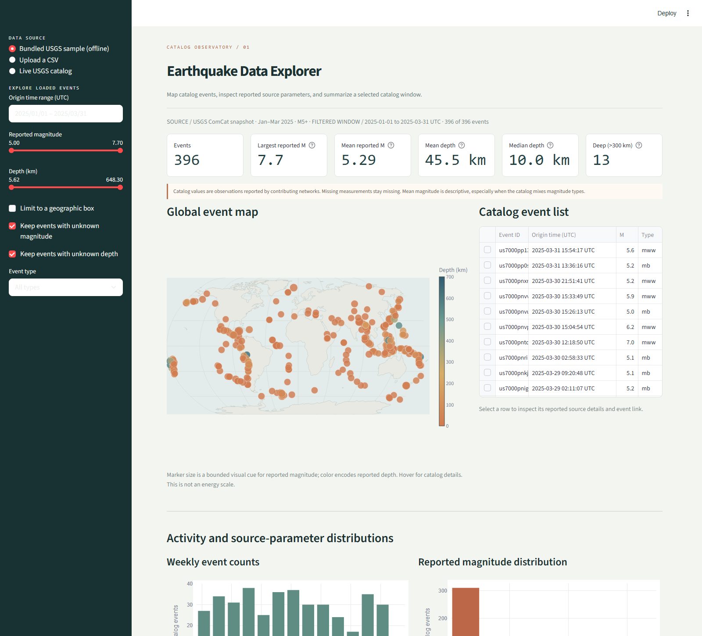

# Earthquake Data Explorer

**An offline-capable earthquake catalog workstation** for mapping reported epicenters, inspecting event records, and summarizing magnitude, depth, and temporal patterns.

The default view is a static snapshot of **396 real USGS ComCat events from 2025 Q1 with reported M ≥ 5**. Live queries use the USGS FDSN Event Web Service. The bundled sample keeps the explorer useful without a network connection.

> This is an educational and data-analysis project. It describes catalog records; it does not predict earthquakes, estimate hazard, or replace professional seismological systems.

## Preview



## Features

- Interactive global geographic projection with pan/zoom, depth-colored markers, magnitude-scaled visual markers, event hover details, and selectable event table rows.
- Query the USGS catalog by UTC date range, magnitude threshold/range, and optional latitude/longitude bounding box.
- Use the bundled ComCat snapshot offline, or upload a CSV with event IDs, times, coordinates, and optional source parameters.
- Filter loaded events by time, magnitude, depth, geographic box, and event type; all statistics and charts follow the filters.
- Inspect event count, largest and mean reported magnitude, mean/median depth, and conventional depth groups, with available/missing counts.
- Explore daily, weekly, or monthly activity, magnitude-bin counts, and magnitude versus depth.
- Export filtered events as CSV and open each selected event's source page when the catalog provides a URL.
- Cache identical live catalog requests in the app process for 15 minutes; network errors leave the bundled sample available.

## Quick start

Python 3.10 or newer is required.

```powershell
cd earthquake-data-explorer
python -m venv .venv
.venv\Scripts\python.exe -m pip install -e ".[dev]"
.venv\Scripts\python.exe -m streamlit run app.py
```

Open the local URL printed in the terminal. In VS Code, open this project folder and use the included **Earthquake Data Explorer** launch profile with **F5**. The plain Run Python File action does not launch Streamlit.

To run offline tests without contacting USGS:

```powershell
.venv\Scripts\python.exe -m unittest discover -s tests -v
```

## Example workflow

1. Start with **Bundled USGS sample (offline)** to inspect the world map and the 2025 Q1 catalog snapshot.
2. Hover over map markers for ID, reported magnitude and type, source time, depth, and event type. Select a row in the catalog table to open the full details and event URL.
3. Adjust the UTC date, magnitude, depth, event-type, or geographic filters; the map, counts, depth groups, and charts update together.
4. Choose **Live USGS catalog**, set a date range and minimum magnitude, optionally define a geographic box, then submit the query.
5. Upload a catalog CSV or export the filtered records for separate analysis.

## USGS catalog integration

The live client uses the documented FDSN Event Web Service query endpoint with `format=geojson`. It sends explicit UTC `starttime`/`endtime`, `minmagnitude`, optional `maxmagnitude`, optional rectangular latitude/longitude bounds, a result limit, and `orderby=time`. The service supports up to 20,000 returned events per query; requests are capped at that documented maximum. Network calls use finite connect/read timeouts and convert timeout, HTTP, and malformed-response conditions into readable errors.

The bundled sample is a dated snapshot. It records its source query and field notes in [`sample_data/SOURCE.md`](sample_data/SOURCE.md). USGS ComCat can revise preferred origins and magnitudes as contributing networks review events, so a later live response can differ from the snapshot.

CSV input requires `event_id` (or `id`), `time` (or `timestamp`), `latitude` (or `lat`), and `longitude` (or `lon`). Optional columns include `depth_km`/`depth`, `magnitude`/`mag`, `magnitude_type`/`magType`, `place`, `event_type`, and `url`. Time values should be parseable timestamps; times without an offset are interpreted as UTC. Invalid rows are counted and skipped. Optional scientific values remain missing rather than being filled with defaults.

## Architecture

```text
app.py                                      Streamlit workstation and cache boundary
src/earthquake_explorer/
  api/usgs.py                               USGS query construction and GeoJSON parsing
  data/models.py                            Validated event record
  data/io.py                                CSV ingestion and table conversion
  analysis/filters.py                       UI-independent filtering
  analysis/statistics.py                    Descriptive summaries and time bins
  visualization/maps.py                    Plotly geographic map
  visualization/charts.py                  Timeline, histogram, depth/magnitude charts
sample_data/                                Real, static USGS ComCat event snapshot
tests/                                      Offline unittest suite with mocked requests
```

### Technology choices

Streamlit provides a local Python interface, controls, caching, and selectable tables. Plotly `Scattergeo` provides a projected geographic view and interactive hover. A bundled generalized Natural Earth land outline supplies map geography locally, so rendering the map does not request map tiles or remote basemap geometry. Pandas handles CSV normalization and time bins; Requests handles bounded-timeout HTTP calls. GeoPandas and SciPy are not needed for the descriptive operations included here.

## Scientific interpretation

- **Magnitude** is a logarithmic measure of earthquake size, not a linear measure of energy or local shaking. Moment magnitude (`Mw`) is based on seismic moment. Catalogs can contain different preferred magnitude types (`Mw`, `mb`, `ML`, etc.); the event type is preserved. The arithmetic mean shown is descriptive across the selected reported numbers and should be interpreted cautiously when magnitude types are mixed. Map marker size is a bounded visual encoding only; it does not represent seismic energy.
- **Depth** is the catalog's reported hypocentral depth in kilometers. It is not always tightly constrained and can use different reference conventions among contributing networks. The app preserves missing depths. For simple counts, it labels shallow events as <70 km, intermediate as 70–300 km, and deep as >300 km; these bins are summaries, not tectonic classifications.
- **Location** in the map is the reported epicenter: the surface coordinate associated with the catalog's hypocenter. It is not a rupture outline. The map color shows reported depth; hover and event details preserve the catalog record.
- **Temporal counts and distributions** describe only events present in the selected catalog and filters. Detection thresholds, network coverage, magnitude completeness, event revisions, and missing values affect those summaries. Spatial density in the map is not a professional cluster analysis.

### Terms

| Term | Meaning in this application |
|---|---|
| Hypocenter | The subsurface point/origin represented by the catalog solution. |
| Epicenter | The latitude/longitude shown on the map, directly above the reported hypocenter. |
| Magnitude | A source-size measure; not the same quantity as felt intensity at a location. |
| Depth | Reported vertical coordinate of the hypocenter in kilometers. |

## Research references

- [USGS FDSN Event Web Service API](https://earthquake.usgs.gov/fdsnws/event/1/) — query parameters, time formats, GeoJSON format, and service limits.
- [USGS GeoJSON summary format](https://earthquake.usgs.gov/earthquakes/feed/v1.0/geojson.php) — feature collection structure, event properties, and `[longitude, latitude, depth]` coordinates.
- [USGS ComCat documentation](https://earthquake.usgs.gov/data/comcat/) — catalog content, source parameters, depth conventions, and revision context.
- [USGS earthquake magnitude, energy release, and shaking intensity](https://www.usgs.gov/programs/earthquake-hazards/earthquake-magnitude-energy-release-and-shaking-intensity) and [magnitude types](https://www.usgs.gov/programs/earthquake-hazards/magnitude-types) — differences among magnitude measures and magnitude versus intensity.
- [Plotly geographic scatter maps](https://plotly.com/python/scatter-plots-on-maps/) and [Streamlit Plotly chart API](https://docs.streamlit.io/develop/api-reference/charts/st.plotly_chart) — map and interaction choices.
- [Natural Earth 1:110m physical vectors](https://www.naturalearthdata.com/downloads/110m-physical-vectors/) — generalized land polygons; [Natural Earth terms](https://www.naturalearthdata.com/about/terms-of-use/) place its vector and raster data in the public domain.

## Limitations and future work

The application uses preferred catalog records and does not retrieve station waveforms, reprocess locations, model source mechanisms, or estimate hazard. A rectangular query box cannot express every region of interest. Large date ranges may need a lower magnitude threshold or smaller region to stay within the service result limit. Potential extensions include polygon-based region filters, explicit catalog completeness diagnostics, and downloadable summary reports with provenance.
